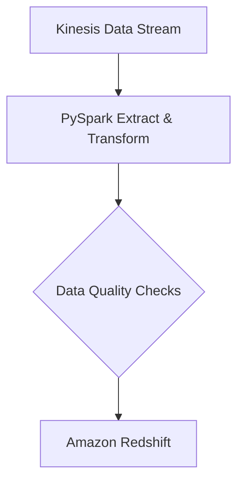

```markdown
# sales_etl Documentation

## Table of Contents

1. [Setup Instructions](#setup-instructions)
2. [Architecture Diagram](#architecture-diagram)
3. [Troubleshooting Guide](#troubleshooting-guide)

## Setup Instructions

To set up and run the `sales_etl` pipeline, follow the steps below:

1. **Install Dependencies**:
   Ensure you have the following libraries installed:
   - PySpark
   - boto3
   - redshift_connector
   - pytest (for testing)

   You can install these using pip:
   ```bash
   pip install pyspark boto3 redshift_connector pytest
   ```

2. **AWS Credentials**:
   - Set up your AWS credentials to interact with Kinesis and other AWS services using `boto3`. Typically, this means ensuring your AWS credentials are stored in `~/.aws/credentials`.

3. **Redshift Configuration**:
   - Ensure your Amazon Redshift cluster is running.
   - Update the JDBC URL, user, and password in the `run_etl_pipeline` function.

4. **Run the Pipeline**:
   Execute the ETL process by running the provided script. This will extract data from the Kinesis data stream, transform it using PySpark, and load it into the Amazon Redshift `sales_fact` table.
   ```bash
   python etl_pipeline.py
   ```

## Architecture Diagram



## Troubleshooting Guide

### Common Issues and Solutions:

1. **AWS Connectivity Issues**:
   - **Problem**: Unable to connect to AWS services.
   - **Solution**: Verify that your AWS credentials are correctly configured and have the necessary permissions. Check your network settings and AWS region configurations.

2. **Data Validation Failures**:
   - **Problem**: Data quality checks are failing.
   - **Solution**: Review the transformation logic and validation rules to ensure data integrity. Correct any data anomalies in the source.

3. **Redshift Load Failures**:
   - **Problem**: Errors while loading data into Amazon Redshift.
   - **Solution**: Ensure that your Redshift cluster is available and the database and table structure match the pipeline configuration. Check for network connectivity issues.

4. **PySpark Errors**:
   - **Problem**: PySpark exceptions during transformation.
   - **Solution**: Inspect the Spark logs for the exact exception and follow standard debugging approaches, such as checking data types and Spark resource configurations.

5. **Performance Issues**:
   - **Problem**: The pipeline is running slower than expected.
   - **Solution**: Optimize your data transformations for performance by partitioning data and utilizing caching in PySpark. For Redshift, review your database design for optimal distribution styles and sort keys.

For further assistance, refer to the [AWS Documentation](https://aws.amazon.com/documentation/) for troubleshooting AWS services and the [Apache Spark Documentation](https://spark.apache.org/docs/latest/) for PySpark-related issues.

This documentation serves as a guide for setting up and troubleshooting the `sales_etl` pipeline efficiently. By following the setup instructions and referring to the architecture diagram, engineers can quickly grasp the workflow, while the troubleshooting section provides solutions for common issues.
```